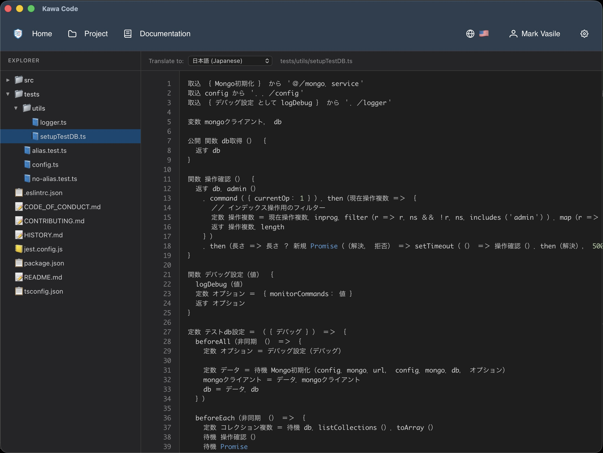

# Kawa i18n Extension 🌍

Internationalization extension for Kawa Code that enables multilingual code development by translating code between languages while preserving TypeScript semantics and IDE support.



## Overview

Kawa i18n allows developers to view code in their native language, speeding up code comprehension for anyone who is not fluent in English. It uses AST-based transformation to translate user-defined identifiers, comments, and string literals, keeping TypeScript keywords in English so the code remains valid and IDE-friendly.

### Key Features

- **Bidirectional Translation**: Translate code between English and any supported language
- **Configurable Scope**: Control what gets translated (identifiers, comments, string literals, markdown)
- **AST-Based**: Uses TypeScript Compiler API for accurate parsing
- **Preserves Formatting**: Maintains exact formatting and whitespace
- **LLM-Powered**: Uses Claude CLI for new translations, with LRU cache for instant repeat lookups
- **Project Scanning**: Scans entire codebases to build dictionaries upfront
- **Dictionary Management**: File-based cache with API sync support
- **Dual IPC**: Communicates with Kawa Code via stdin/stdout and directly with code editors via Unix sockets
- **Intent Translation**: Translates intent titles and descriptions for the Kawa collaboration layer
- **IDE-Friendly**: Keywords stay in English for full tooling compatibility

## Architecture

```
kawa.i18n/
├── src/
│   ├── core/                       # Translation engine
│   │   ├── types.ts               # Type definitions (LanguageCode, TranslationScope, etc.)
│   │   ├── translator.ts          # Original translator (toEnglish/toCustom)
│   │   ├── unifiedTranslator.ts   # Unified translator (any language pair)
│   │   ├── astTransformer.ts      # AST transformation
│   │   ├── tokenMapper.ts         # Bidirectional token mapping
│   │   ├── identifierExtractor.ts # Extracts identifiers from source code
│   │   ├── commentExtractor.ts    # Extracts comments from source code
│   │   └── markdownExtractor.ts   # Extracts translatable text from .md files
│   ├── claude/                     # LLM integration (Claude CLI)
│   │   ├── cli.ts                 # Spawns Claude CLI subprocess, retry logic
│   │   ├── prompts.ts            # Translation prompts and response parsing
│   │   ├── translator.ts         # High-level batching API
│   │   └── index.ts              # Re-exports
│   ├── dictionary/                 # Dictionary management
│   │   ├── cache.ts              # File-based cache (~/.kawa-code/i18n/)
│   │   ├── manager.ts            # Dictionary lifecycle (load, create, sync)
│   │   └── multiLang.ts          # Multi-language dictionary (English hub model)
│   ├── ipc/                        # IPC communication
│   │   ├── protocol.ts           # Message protocol, logging
│   │   ├── handlers.ts           # Kawa Code stdin/stdout message handlers
│   │   ├── server.ts             # Direct Huginn IPC server (Unix sockets)
│   │   └── stream-buffer.ts      # Circular buffer for large messages
│   ├── intent/                     # Intent translation handlers
│   │   ├── handlers.ts           # Intent metadata translation
│   │   ├── cache.ts              # Intent cache
│   │   ├── types.ts              # Intent types
│   │   └── index.ts              # Re-exports
│   ├── api/                        # Kawa API client
│   │   └── client.ts             # HTTP client for dictionary sync
│   ├── auth/                       # Authentication
│   │   └── store.ts              # In-memory auth token store
│   ├── config/                     # Configuration
│   │   ├── settings.ts           # Extension settings and translation scope
│   │   └── index.ts              # Re-exports
│   └── index.ts                    # Main entry point
├── ui/                             # Web UI (Lit web components)
│   └── src/
│       ├── code-viewer.ts         # Translated code viewer screen
│       ├── settings.ts            # Translation scope settings panel
│       ├── ipc-bridge.ts          # IPC bridge for UI ↔ extension
│       └── index.ts               # Web component registration
├── examples/                       # Usage examples and test scripts
├── binaries/                       # Compiled binaries (gitignored)
└── extension.json                  # Extension manifest for Kawa Code
```

## Installation

```bash
# Install dependencies
npm install

# Build TypeScript
npm run build

# Build binary for macOS
npm run build:macos
```

## Standalone Usage

```typescript
import { Translator } from './src/core/translator';

// Define token mapping
const mapping = {
  'Calculator': 'Calculadora',
  'add': 'sumar',
  'result': 'resultado',
};

const translator = new Translator(mapping);

// Original English code
const code = `
class Calculator {
  add(a: number, b: number): number {
    const result = a + b;
    return result;
  }
}
`;

// Translate to Spanish
const spanish = translator.toCustom(code);
console.log(spanish.code);
// Output:
// class Calculadora {
//   sumar(a: number, b: number): number {
//     const resultado = a + b;
//     return resultado;
//   }
// }

// Translate back to English
const english = translator.toEnglish(spanish.code);
// Perfectly restored!
```

## Kawa Code Extension Usage

### IPC Protocol

The extension communicates with Kawa Code via stdin/stdout using the Kawa IPC protocol:

```typescript
{
  flow: 'req' | 'res' | 'err' | 'brdc',
  domain: 'i18n',
  action: string,
  caw: string,
  data: any,
  _msgId?: string
}
```

### Available Actions (via Kawa Code stdin/stdout)

| Action | Description |
|--------|-------------|
| `translate-code` | Translate a code file using the dictionary. Requires `translationScope`. |
| `file-saved` | Translate foreign-language code back to English on save. |
| `scan-project` | Scan a workspace for identifiers/comments and build a dictionary via Claude CLI. |
| `proceed-translation` | Confirm and start translation for a large project (after scan shows stats). |
| `load-dictionary` | Load or create a dictionary for a repository + language pair. |
| `add-terms` | Add terms to an existing dictionary. |
| `list-dictionaries` | List all cached dictionaries. |
| `extract-identifiers` | Extract all identifiers from source code (without translating). |
| `get-settings` | Get current translation scope settings. |
| `set-settings` | Update translation scope settings. |
| `normalize-intent` | Normalize an intent title for matching. |
| `translate-intent-metadata` | Translate intent title/description to a target language. |
| `detect-language` | Detect the language of a text string. |

#### Example: `translate-code`

**Request:**
```json
{
  "flow": "req",
  "domain": "i18n",
  "action": "translate-code",
  "caw": "1",
  "data": {
    "code": "class Calculator { ... }",
    "filePath": "src/calculator.ts",
    "sourceLang": "en",
    "targetLang": "ja",
    "origin": "https://github.com/user/repo.git",
    "translationScope": {
      "comments": true,
      "stringLiterals": true,
      "identifiers": true,
      "keywords": false,
      "punctuation": false,
      "markdownFiles": false
    }
  }
}
```

**Response:**
```json
{
  "success": true,
  "code": "translated code...",
  "translatedTokens": ["Calculator", "add"],
  "unmappedTokens": []
}
```

### Direct Huginn IPC Actions (via Unix socket)

Huginn editor extensions, such as the Kawa Code extensions in Visual Studio Code, can also connect directly to the i18n extension's Unix socket, bypassing Kawa Code. These handlers enrich messages with `origin` and language automatically:

| Action | Description |
|--------|-------------|
| `i18n:translate-code` | Translate code (origin resolved from file path). |
| `i18n:file-saved` | Translate back to English on save. |
| `user:set-language` | Set the user's preferred language for a CAW. |
| `user:get-language` | Get the current language for a CAW. |
| `intent:get-for-file` | Get intents for a file (translated). |
| `intent:get-for-lines` | Get intents for specific lines (translated). |

### Broadcast Handlers

The extension also listens for broadcasts from Kawa Code:

| Domain:Action | Description |
|---------------|-------------|
| `repo:active-path` | Syncs dictionary if remote version is newer. |
| `repo:head-changed` | Triggers project re-scan after git pull/checkout/merge. |
| `auth:info` | Stores auth tokens for API calls. |
| `extension:ready` | Initializes auth state on Kawa Code startup. |

### Progress Updates

The extension sends progress broadcasts to Kawa Code via the `extension-progress` domain:

```json
{
  "flow": "brdc",
  "domain": "extension-progress",
  "action": "progress",
  "caw": "0",
  "data": {
    "extensionId": "i18n",
    "taskId": "scan-project-ja-1234567890",
    "title": "Project Scan",
    "status": "processing",
    "statusMessage": "Translating terms batch 2/5 (100 items)...",
    "progress": 60,
    "autoClose": true,
    "autoCloseDelay": 3000
  }
}
```

## Dictionary Cache

Dictionaries are stored in `~/.kawa-code/i18n/dictionaries/` as JSON files:

```json
{
  "origin": "https://github.com/user/repo.git",
  "language": "ja",
  "terms": {
    "Calculator": "計算機",
    "add": "追加",
    "subtract": "減算"
  },
  "comments": {
    "a1b2c3...": {
      "en": "Calculate the sum of two numbers",
      "ja": "2つの数値の合計を計算する"
    }
  },
  "metadata": {
    "createdAt": "2024-01-01T00:00:00.000Z",
    "updatedAt": "2024-01-02T00:00:00.000Z",
    "lastSyncDate": "2024-01-02T00:00:00.000Z",
    "version": "1.0.0"
  }
}
```

Translation scope settings are stored separately in `~/.kawa-code/i18n/settings.json`.

## Development

```bash
# Run in dev mode
npm run dev

# Watch mode
npm run dev:watch

# Run example
npm run example

# Build (TypeScript + UI)
npm run build

# Build platform binaries
npm run build:macos
npm run build:windows
npm run build:linux

# Tests
npm test                    # Jest unit tests
npm run test:watch          # Watch mode
npm run test:coverage       # With coverage
npm run test:roundtrip      # Roundtrip translation test
npm run test:comprehensive  # Comprehensive roundtrip test
npm run test:all            # All tests combined

# Clean
npm run clean
```

## Supported Languages

- `en` - English (source language)
- `ja` - Japanese
- `es` - Spanish
- `fr` - French
- `de` - German
- `zh` - Chinese
- `ko` - Korean
- `ru` - Russian
- `pt` - Portuguese
- `it` - Italian
- `ar` - Arabic
- `hi` - Hindi
- `vi` - Vietnamese
- `th` - Thai
- `nl` - Dutch
- `pl` - Polish
- `tr` - Turkish
- `uk` - Ukrainian
- `cs` - Czech
- `sv` - Swedish

To add a new language, see [Adding New Languages](#adding-new-languages) below.

## Changing the LLM Provider

The i18n extension translates code by calling an LLM. By default it uses the **Claude CLI** (`claude --print --output-format json`), but you can swap it for any other provider (e.g. Ollama, OpenAI). All translation logic lives entirely within the i18n extension.

### Architecture

The LLM integration is isolated to four files:

| File | Role |
|------|------|
| `src/claude/cli.ts` | Spawns the LLM subprocess and parses the response |
| `src/claude/prompts.ts` | Builds translation prompts and parses numbered-list responses |
| `src/claude/translator.ts` | High-level API that batches terms and calls `callClaude()` |
| `src/config/settings.ts` | Extension configuration (add provider/model settings here) |

Kawa Code is **not involved** in translation. It only provides repo metadata (origin, intents) via IPC.

### Steps to Use Ollama (or Another Provider)

1. **Replace `callClaude()` in `src/claude/cli.ts`**

   The current implementation spawns `claude` as a subprocess. Replace or wrap it to call your provider instead. For Ollama, you can use its REST API:

   ```typescript
   // Example: call Ollama's local API instead of Claude CLI
   import http from 'http';

   export async function callClaude(prompt: string, workingDir?: string): Promise<string> {
     const body = JSON.stringify({
       model: 'llama3',       // or any model you have pulled
       prompt,
       stream: false,
     });

     return new Promise((resolve, reject) => {
       const req = http.request(
         { hostname: 'localhost', port: 11434, path: '/api/generate', method: 'POST',
           headers: { 'Content-Type': 'application/json' } },
         (res) => {
           let data = '';
           res.on('data', (chunk) => data += chunk);
           res.on('end', () => {
             const parsed = JSON.parse(data);
             resolve(parsed.response);
           });
         }
       );
       req.on('error', reject);
       req.write(body);
       req.end();
     });
   }
   ```

2. **Update `isClaudeCliAvailable()` in `src/claude/cli.ts`**

   Replace the availability check to verify your provider is running:

   ```typescript
   export async function isClaudeCliAvailable(): Promise<boolean> {
     // For Ollama: check if the API is reachable
     return new Promise((resolve) => {
       const req = http.get('http://localhost:11434/api/tags', (res) => {
         resolve(res.statusCode === 200);
       });
       req.on('error', () => resolve(false));
     });
   }
   ```

3. **Adjust prompts if needed (`src/claude/prompts.ts`)**

   The prompts are designed for Claude's instruction-following style. Smaller or different models may need:
   - Simpler prompt structure
   - Fewer rules per prompt
   - Explicit JSON output instructions
   - Smaller batch sizes (configured in `src/claude/translator.ts`: identifiers=100, comments=30, text=30)

4. **Make it configurable (optional)**

   Add provider/model settings to `src/config/settings.ts` so users can switch without editing code:

   ```typescript
   export interface I18nSettings {
     translateEnglishOnSave: boolean;
     llmProvider: 'claude' | 'ollama' | 'openai';
     ollamaModel: string;    // e.g. 'llama3', 'mistral', 'codellama'
     ollamaEndpoint: string;  // default: 'http://localhost:11434'
   }
   ```

### Notes

- All translation happens locally on the user's machine regardless of provider.
- The response parser in `prompts.ts` (`parseNumberedListResponse`) expects a numbered list format (e.g. `1. translation`). Ensure your model follows this format or adjust the parser.
- Batch sizes and inter-batch delays are in `src/claude/translator.ts`. Reduce batch sizes for less capable models.

## Adding New Languages

The i18n extension supports adding new languages. There are three places to update:

### 1. Add the Language Code (`src/core/types.ts`)

Add your language code to the `LanguageCode` type:

```typescript
// Before
export type LanguageCode = 'en' | 'ja' | 'es' | 'fr' | 'de' | 'zh' | 'ko' | 'ru' | 'pt' | 'it' | 'ar';

// After (e.g. adding Finnish)
export type LanguageCode = 'en' | 'ja' | 'es' | 'fr' | 'de' | 'zh' | 'ko' | 'ru' | 'pt' | 'it' | 'ar' | 'fi';
```

### 2. Add the Display Name (`src/claude/prompts.ts`)

Add the language name to the `LANGUAGE_NAMES` map so prompts reference it correctly:

```typescript
const LANGUAGE_NAMES: Record<string, string> = {
  en: 'English',
  ja: 'Japanese',
  // ... existing languages ...
  fi: 'Finnish',      // add your language here
};
```

If your language code isn't in this map, prompts will fall back to the uppercase code (e.g. `FI`), which still works but is less clear to the LLM.

### 3. Update the README

Add the language to the **Supported Languages** list in this README.

### That's It

No other changes are required. The translation engine, dictionary cache, AST transformer, and IPC protocol are all language-agnostic. They work with any language code and Unicode script. The LLM handles the actual translation based on the language name embedded in the prompt.

### Language-Specific Prompt Tuning (Optional)

If translation quality for your language needs improvement, you can add language-specific guidelines to the prompts in `src/claude/prompts.ts`. For example, the existing prompts include:

```
- For Japanese: Prefer kanji over katakana where natural
```

You can add similar rules for your language in `buildIdentifierTranslationPrompt()`.

## How It Works

1. **Parsing**: TypeScript Compiler API parses code into AST
2. **Extraction**: Traverses AST to find identifiers, comments, and string literals
3. **Dictionary Lookup**: Matches extracted tokens against the cached dictionary
4. **Replacement**: Text-based replacement preserves exact formatting
5. **Output**: Returns translated code with metadata

For new projects (empty dictionary), a full project scan triggers LLM translation via Claude CLI, builds the dictionary, and caches it for instant future lookups.

**Key Feature**: Uses text-based replacement (not AST printer) to maintain formatting:
- Empty lines preserved
- Indentation style unchanged
- Comments kept in place
- Whitespace maintained

## Important Behavior

### Keywords Stay in English

TypeScript keywords (`function`, `const`, `if`, `return`, etc.) are **not translated**. This is intentional:

✅ **IDE Support**: Full syntax highlighting and autocomplete
✅ **TypeScript Compiler**: Code remains valid TypeScript
✅ **Tooling**: All TypeScript tools work normally

By default, **user-defined identifiers and comments** are translated. String literals and keywords can be enabled via translation scope settings.

### Example

```typescript
// Original
function calculateSum(value: number): number {
  return value + 10;
}

// After translation to Spanish
function calcularSuma(valor: number): number {
  return valor + 10;
}
```

Notice: `function` and `return` stay in English.

## Programming Language Support

The identifier extractor currently supports:

| Language | File Extensions | Extraction Method |
|----------|----------------|-------------------|
| TypeScript / JavaScript | `.ts`, `.tsx`, `.js`, `.jsx`, `.mjs`, `.cjs` | Full AST via TypeScript Compiler API |
| Vue | `.vue` | Extracts `<script>` block, then uses TS parser |
| Rust | `.rs` | Regex-based pattern matching |

### Roadmap: Additional Languages

The architecture is designed to support more languages. Adding a new language requires:

1. **Identifier extraction** - add a `extractFrom<Language>()` method in `src/core/identifierExtractor.ts` with a regex or parser-based approach (Rust is a working example of the regex approach)
2. **Comment extraction** - add the corresponding logic in `src/core/commentExtractor.ts`
3. **File extension registration** - add the extension to `codeExtensions` in `src/index.ts`

The translation engine, dictionary cache, and IPC layer are all language-agnostic - they work with identifier strings regardless of the source programming language. The main effort is writing the extraction logic.

Planned languages (contributions welcome):
- **Python** (`.py`) - regex-based, similar to Rust
- **Go** (`.go`) - regex-based
- **Java / Kotlin** (`.java`, `.kt`) - regex-based
- **C / C++** (`.c`, `.cpp`, `.h`) - regex-based

## Limitations

- **Keywords**: TypeScript keywords remain in English by default (can be enabled in scope settings)
- **Identifier Characters**: Translations must be valid JavaScript identifiers (no spaces, hyphens, etc.)
- **Built-in Types**: Standard library types (`Array`, `Promise`, etc.) are not translated
- **Claude CLI Required**: New translations require the Claude CLI to be installed locally
- **Non-TS/JS languages**: Rust extraction is regex-based (less precise than AST); other languages not yet supported

## Integration with Kawa Architecture

### Extension Lifecycle

1. **Startup**: Kawa Code spawns extension as child process (configured in `extension.json`)
2. **Registration**: Extension registers IPC handlers for both Kawa Code and direct Huginn connections
3. **Communication**: Two channels - Kawa Code (stdin/stdout) and Huginn editors (Unix sockets)
4. **Auth**: Receives auth tokens from Kawa Code's `auth:info` broadcast
5. **Shutdown**: STDIN close triggers graceful exit

### Data Flow

```
                    ┌──────────────────────────────┐
                    │       i18n Extension         │
                    │                              │
Editor ──(socket)──►│  Direct Huginn IPC Server    │
  (Huginn)          │         │                    │
                    │         ▼                    │
                    │  ┌─────────────┐   ┌──────┐  │
Kawa Code ──(stdin)───►│  │  Handlers│──►│ Dict │  │
                    │  └──────┬──────┘   │ Cache│  │
                    │         │          └──────┘  │
                    │         ▼                    │
                    │  ┌─────────────┐             │
                    │  │ AST Engine  │             │
                    │  └──────┬──────┘             │
                    │         │                    │
Kawa Code◄─(stdout)─│         ▼                    │
Editor  ◄─(socket)──│  Translated Code             │
                    └──────────────────────────────┘
```

### Web UI

The extension provides two web components (Lit-based) rendered inside Kawa Code's UI:

- **Code Viewer** (`code-viewer`): Displays translated source code (registered as a screen under Tools)
- **Settings** (`i18n-settings`): Translation scope configuration panel

## License

MIT

## Credits

Built with the TypeScript Compiler API.

---

**Happy Translating! 🚀**
